# bookmarklets

Hallo, schön dich hier zu sehen! Hier findest du eine Auswahl meiner nützlichsten Bookmarklet die ich nutze. Diese habe ich selbst erstellt als ich bemerkt habe, wie sie einem das tägliche Leben vereinfachen können.

Du kannst diese Bookmarklets völlig frei verwenden und/oder verändern wie es dir gefällt. Gern kannst du auch zur Verbesserung oder Optimierung dieser beitragen.

Bitte beachte, dass du nur den JavaScript Code ohne Kommentare aus den einzelnen Scripten kopieren musst.

# Scripts
## _browser_info.js
This bookmarklet gives you some useful information about the browser you are using. 

Some properties are already depricated and there is no guarantee that they will return the correct value in the future.
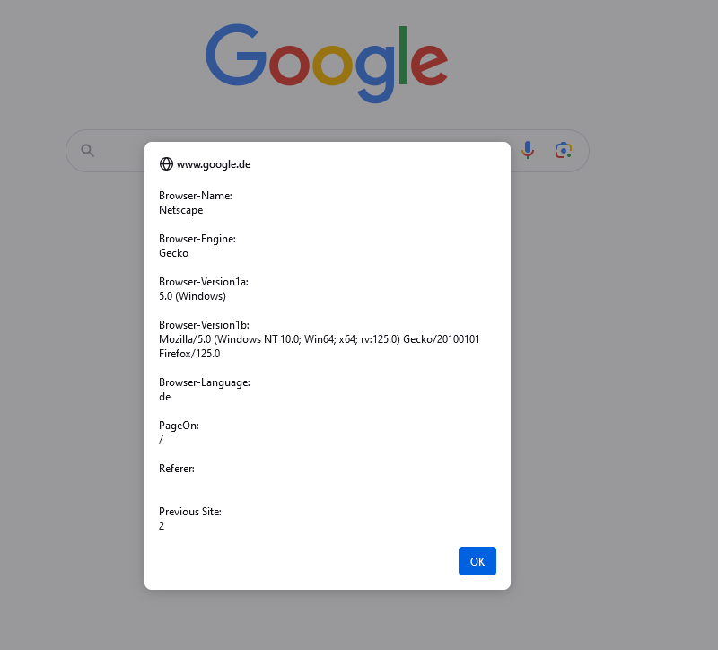

## _correct_grammar_and_wording_with_deepl.js
This bookmarklet corrects the selected text for grammar and punctuation using deepl.com. It opens a new popup with more options. 

By default the text will be corrected in German. If you change the abbreviation "de" in the source text, you can choose another language.

Note: Doesn't work in iframes!
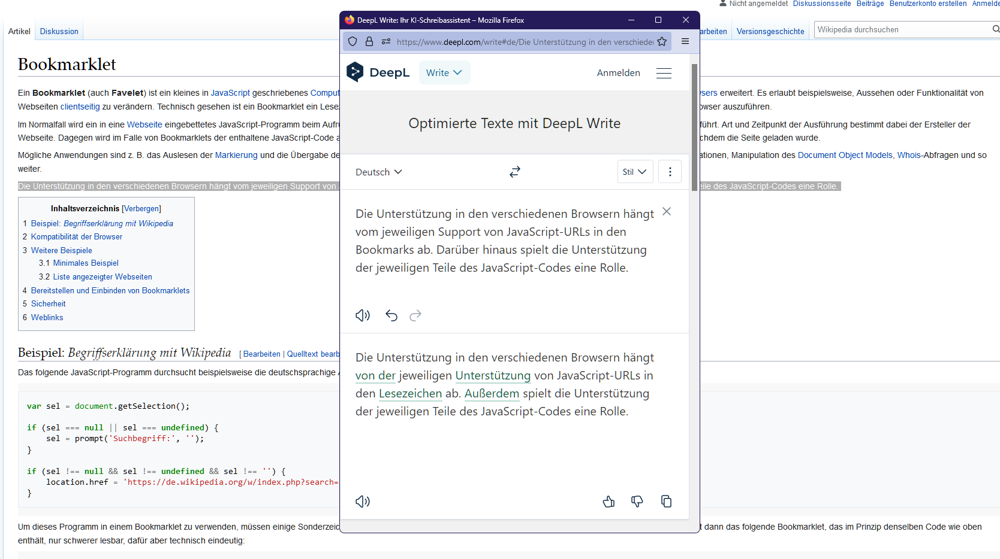

## _epoch_converter.js
With this bookmarklet you can convert Unix times. Simply enter the Unix time in the dialog that opens and click on "ok" to get the correct date and time.
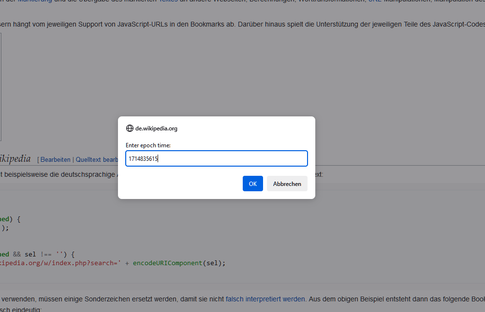
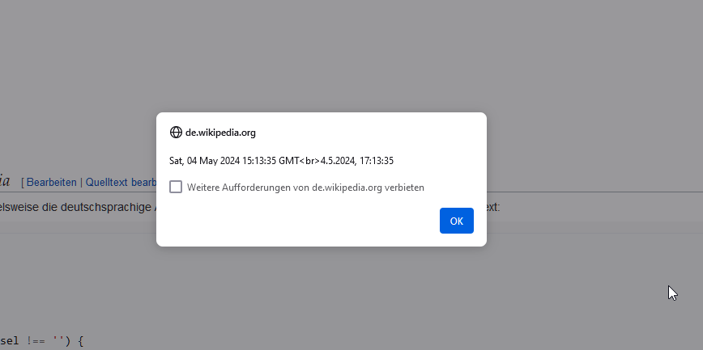

## _sha265_string.js
This bookmarklet allows you to hash any text with SHA-256. Clicking on the bookmarklet opens a dialog where you can enter the text. Clicking "ok" will copy the hash value directly to the clipboard. 

For the sake of simplicity, I left out the confirmation dialog.
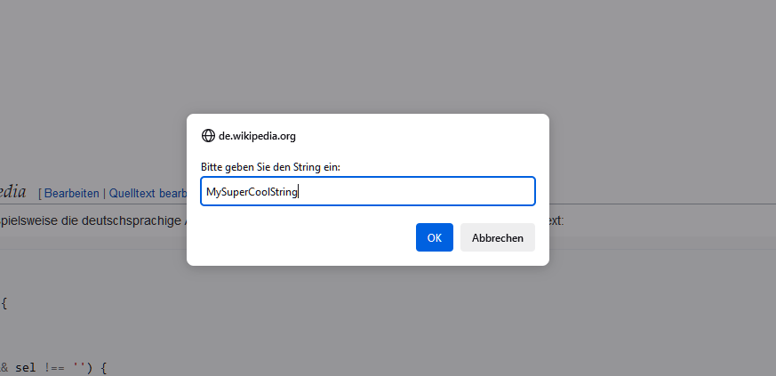

## _show_password.js
This bookmarklet shows you all passwords available on this site. 

Important: It only shows passwords that have already been entered or passwords that the browser has already filled in and unmasks them!
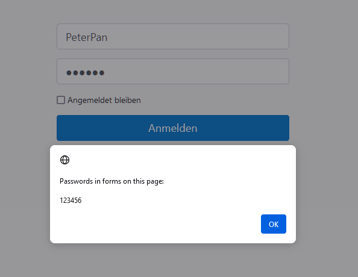

## _translate_selected_text_with_deepl.js
This bookmarklet translates the selected text with deepl.com. After clicking on it, a new popup will be opened where you can change the settings. By default this bookmarklet translates text to German. However, by changing the abbreviation "de" in the source code, translation into other languages is also possible. It is also possible to select a different target language in the popup that opens.

Note: Doesn't work in iframes!
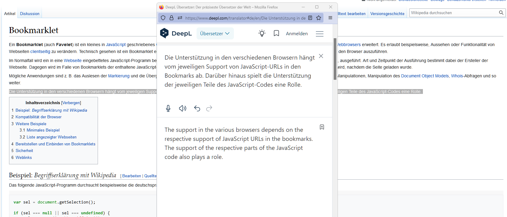

## _translate_selected_text_with_google.js
This bookmarklet translates the selected text with google.com. After clicking on it, a new popup will be opened where you can change the settings. By default this bookmarklet translates text to German. However, by changing the abbreviation "de" in the source code, translation into other languages is also possible. It is also possible to select a different target language in the popup that opens.

Note: Doesn't work in iframes!
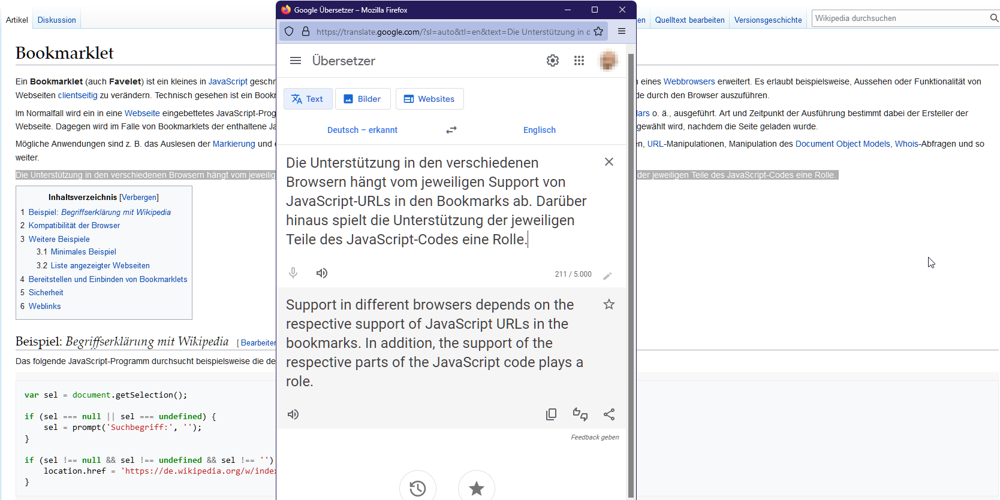

## _upper_and_lower_text_from_selection.js
This bookmarklet converts the selected text alternately into lowercase and uppercase letters and copies the result to the clipboard. Works with texts of any length.

Thus the word "Boomer" becomes the word "bOoMeR"

Note: Doesn't work in iframes!
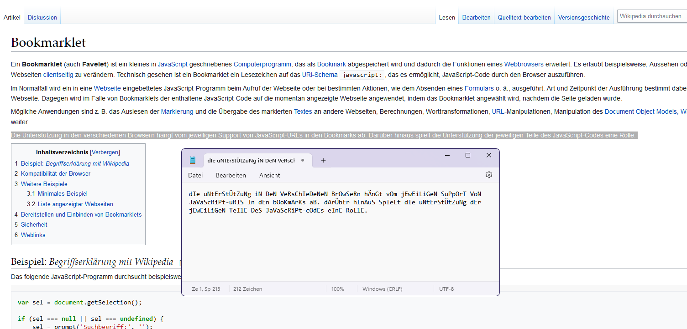

## _user_agent.js
This bookmarklet shows you the user agent you are currently using.
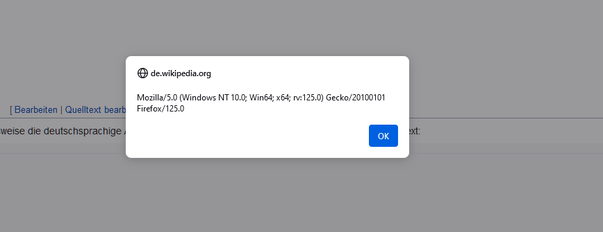

## _website_notes_in_local_storage_of_the_browser.js
This bookmarklet allows you to make notes about individual web pages that you can refer to again and again. The notes are stored in your browser's LocalStorage and remain available until you clear it. This means that your notes will survive a browser restart and will still be available.

Clicking on the bookmarklet opens a modal dialog where you can enter your note. If a note has already been saved for this site, you can edit the existing text.

The code is relatively easy to read, so you can customize it to your liking.
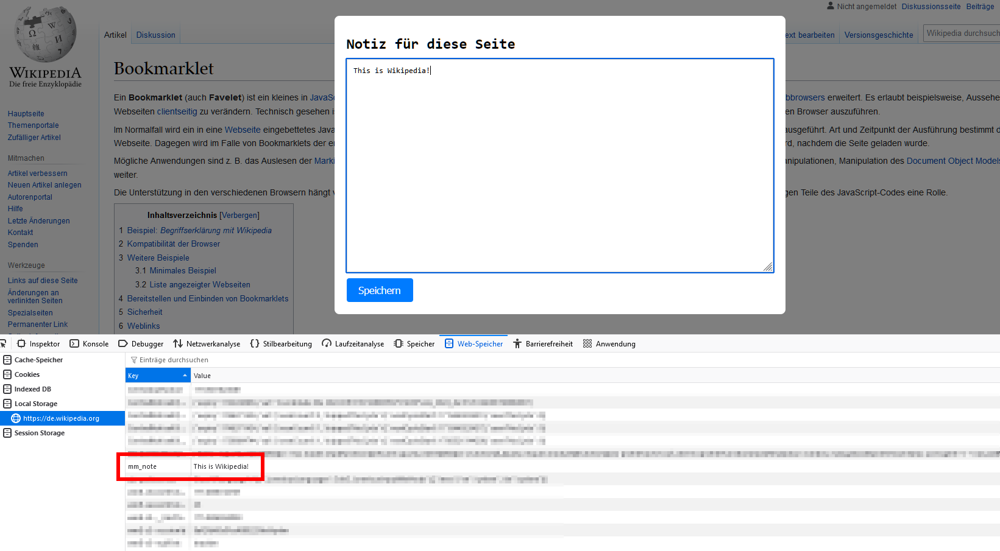
